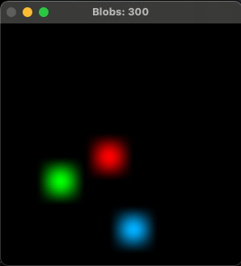

# Custom Environment Q-Learning

This project implements Q-Learning to train an agent to play a custom game in a custom environment using a Q-table. The trained Q-table is saved to `custom_env_q_table.pkl` to be used as a starting point for future trainings.



## Table of Contents

- [Introduction](#introduction)
- [Usage](#usage)
- [Results](#results)
- [Contributing](#contributing)
- [License](#license)

## Introduction

Q-Learning is a model-free reinforcement learning algorithm used to find the optimal action-selection policy for a given finite Markov decision process. In this project, Q-Learning is used to train an agent to play a custom game.

## Usage

1. **Training the agent:**

    Run the Jupyter notebook to train the agent. The notebook will save the Q-table to `custom_env_q_table.pkl` once the training is completed.

    ```bash
    jupyter notebook custom_env_q_learning.ipynb
    ```

2. **Using the pre-trained Q-table:**

    The saved Q-table can be loaded and used as a starting point for future trainings or to evaluate the agent's performance. In the Jupyter notebook, you can load the Q-table as follows:

    ```python
    import pickle

    with open('custom_env_q_table.pkl', 'rb') as f:
        q_table = pickle.load(f)
    ```

## Results

The performance of the agent improves over time as the Q-learning algorithm updates the Q-table. Custom environment is based on the tutorial by [sentdex](https://www.youtube.com/@sentdex)